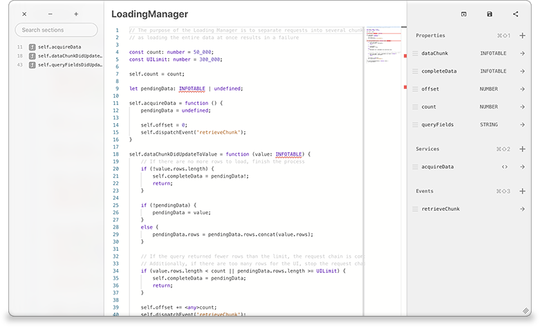
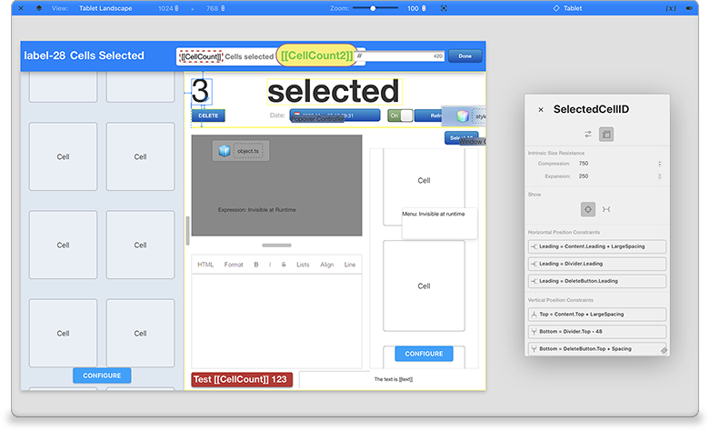
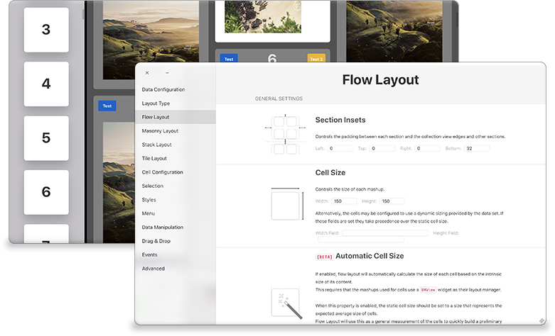
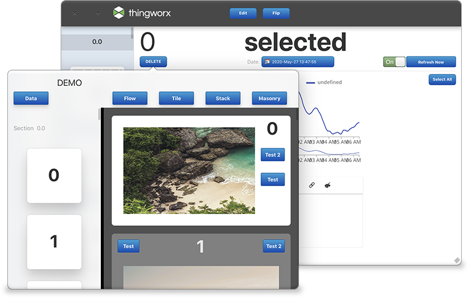
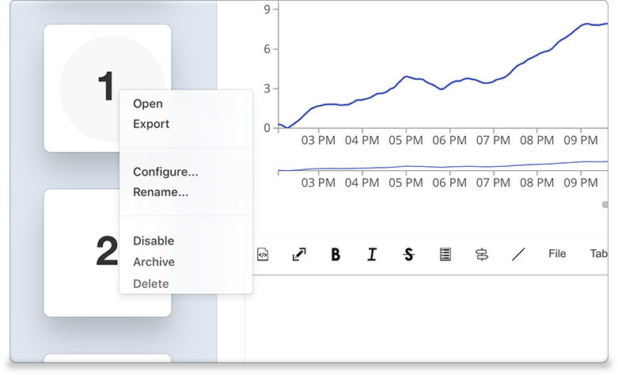

# 1. Introduction

This project merges BMCoreUI and all of its dependent widgets into a single package whose contents are wrapped in an IIFE to avoid any conflict with the declarations in the Thingworx runtime, essentially causing Core UI and its widgets to live in their own private scope.

The primary purpose of this package is to allow the use of Core UI widgets without interfering with the functionality of the built in `Collection` widget. Additionally, it eliminates the possibility of using mismatching versions of the various Core UI based extensions.

This repository contains the build script required to merge and package the Core UI based projects, but not the other projects themselves. The release packages do contain everything.

# 2. Index

- [About](#about)
- [Usage](#usage)
- [Development](#development)
  - [Pre-Requisites](#pre-requisites)
  - [Development Environment](#development-environment)
  - [File Structure](#file-structure)
  - [Build](#build)  
  - [Deployment](#deployment)  
- [License](#license)

# 3. About

This package is made up of the following individual extensions that you should **remove prior to installing this package**, if you have the standalone versions. 
These packages are still available and can be built and imported individually if compatibility with the `Collection` widget is not required.

## [BMCoreUI](https://github.com/BogdanMihaiciuc/BMCoreUI)

A javascript library containing the base functionality upon which the widgets in this package are built. Core UI does not require Thingworx and can be included in any front-end project via npm.

## [BMCodeHost](https://github.com/BogdanMihaiciuc/BMCodeHost)



BMCodeHost is the ultimate tool in a mashup builder's arsenal and likely the most impactful widget in the package, giving developers complete freedom in developing their applications. It offers a set of widgets that provide a very simple, yet very powerful capability - it lets developers add their own JavaScript, TypeScript or CSS code to a mashup, without any restrictions on what is allowed and what is not.

It also provides a layer that allows the custom code to very easily interact with the rest of the mashup, by specifing properties, events and services just like any other widget as well as various methods to obtain references to the other widgets in the mashup.

To make development as comfortable as possible, Code Host relies on the [Monaco Editor](https://github.com/ptc-iot-sharing/MonacoEditorTWX) extension to provide an advanced code editor with many useful features.

## [BMView](https://github.com/BogdanMihaiciuc/BMView)



BMView brings constraint-based layouts to Thingworx, enabling application developers to create large and complex layouts based on easy to understand rules that are established between the various application elements.

It includes its own custom-built layout editor with a lot of options for positioning and sizing page elements as well as support for responsive layouts and support for dynamically specifying and changing the various layout rules at runtime.

## [BMCollectionView](https://github.com/BogdanMihaiciuc/BMCollectionView)



BMCollectionView is a widget whose primary goal is to allow mashup developers to display collections of items with arbitrary content in a scrolling container. Collection View is optimized such that it should have good performance characteristics even when containing hundreds of thousands of items.

Additionally, it offers an impressive number of customization options which are broken down into categories and explained individually in a custom configuration window to make setup easier. Because of this flexibility, collection view can scale from being used as a simple list of items to being used as an automatic UI builder for significant portions of your Thingworx application.

Finally, it supports advanced features such as menus, data manipulation, drag & drop and a set of controller widgets that can be used to further control many of the standard behaviours and elements, making it a tool that can fit a large number of use cases.

## [BMPresentationController](https://github.com/BogdanMihaiciuc/BMPresentationController)



The BMPresentationController widgets give developers the ability to display their mashups in window or popover controls. Windows can also be configured such that they can be moved and resized freely. It is also possible to have multiple windows open and interact between them, for example via collection view's drag & drop functionality.

## [BMMenu](https://github.com/BogdanMihaiciuc/BMMenu)



A simple yet useful widget allowing developers to create context menus available via right clicks or long taps attached to widgets or specific areas of the page.

# 4. Usage

To install this package on Thingworx, you can download one of the release packages and directly import it as an extension.

Alternatively, you can clone this repo and all dependent repos and build the extension from it.

# 5. Development

### 5.1. Pre-Requisites

The following software is required:

* [NodeJS](https://nodejs.org/en/): needs to be installed and added to the `PATH`. You should use the LTS version.
* [gulp command line utility](https://gulpjs.com/docs/en/getting-started/quick-start): is needed to run the build script.

### 5.2. Development Environment
In order to develop and build this repo you need to do the following:
1. Clone this repository and the following repositories and place them in the same folder:
 - [BMCoreUI](https://github.com/BogdanMihaiciuc/BMCoreUI)
 - [BMView](https://github.com/BogdanMihaiciuc/BMView)
 - [BMCollectionView](https://github.com/BogdanMihaiciuc/BMCollectionView)
 - [BMPresentationController](https://github.com/BogdanMihaiciuc/BMPresentationController)
 - [BMMenu](https://github.com/BogdanMihaiciuc/BMMenu)
 - [BMCodeHost](https://github.com/BogdanMihaiciuc/BMCodeHost)
2. Open `package.json` and configure the `thingworxServer`, `thingworxUser` and `thingworxPassword` as needed.
3. In `Gulpfile.js`, ensure that the folder names match.
4. Run `npm install` for each of the downloaded repos. This will install the required dependencies for each project.
5. Run `gulp` to merge and build the package.

### 5.3. File Structure
```
BMCoreUIWidgets
│   README.md         // this file
│   package.json      // here you specify Thingworx connection details
│   LICENSE           // license file
│   Gulpfile.js       // build script
└───build             // temporary folder used during compilation
└───zip               // location of the built extension
```

### 5.4. Build
To build the extension, run `gulp` in the root of the project. This will build all sub projects, merge them and then generate an extension .zip file in the zip folder in the root of this project. The following tasks are available:
 - `gulp`: explained above
 - `gulp upload`: same as `gulp`, but also uploads the extension to the Thingworx server specified in package.json
 - `gulp merge`: merges the sub projects and creates the extension zip, but does not build the individual sub projects

To build the extension and upload it to Thingworx, run `gulp upload` in the root of the project. The details of the Thingworx server to which the script will upload the extension are declared in the project's `package.json` file. These are:
 * `thingworxServer` - The server to which the extension will be uploaded.
 * `thingworxUser` and `thingworxPassword` - The credentials used for uploading. This should be a user that has permission to install extensions.

### 5.5. Deployment

Deployment to Thingworx is part of the build process as explained above. Alternatively, you can manually install the extension that is generated in the zip folder in the root of the project.

# 6. License

[MIT License](LICENSE)